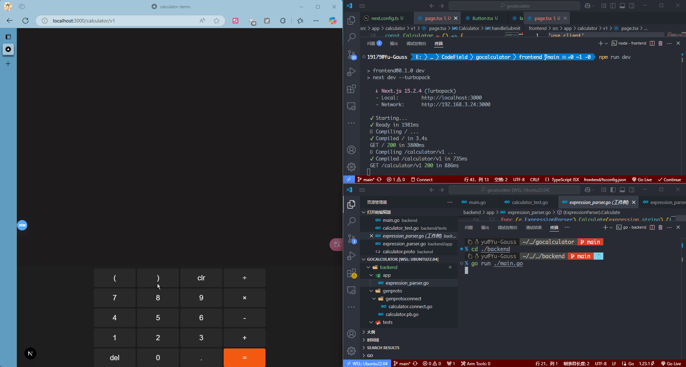

# A Calculator Web Demo

- Frontend: Next.js, React
- Backend: Golang, ConnectRPC, gRPC, Protobuf
  


## Run frontend

```sh
cd ./frontend
npm install
npm run dev
```

## Run backend

```sh
cd ./backend
go mod tidy
go run ./main.go
```

## Simple unit test for backend

In directory `backend/tests` ...